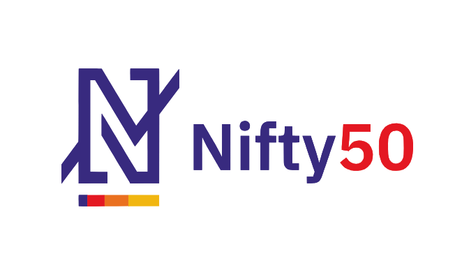

 
# Nifty50 Stock Market Screener with Streamlit !!
## Introduction
<p>
This NIFTY50 Stock Screener is an automated Python-based tool designed to analyze, filter, and track real-time performance of India's premier 50 companies listed on the NSE. It enables investors to scan stocks based on custom criteria—including moving averages, volume, and volatility—using live market data to simplify technical analysis.
</p>

## Project Scope
1. Data Source: Fetches real-time financial data using the yfinance library.
2. Target Scope: Covers all 50 stocks listed on the NSE NIFTY 50 index.
3. Functionality: Fundamental company information, technical analysis, and price visualization.
4. Dashboarding: Interactive and user-friendly interface deployed via Streamlit.

## Key Features
1. Live NIFTY50 Stock Selection: A sidebar dropdown to select any NIFTY 50 stock for analysis.
2. Company Fundamental Data:  Displays key statistics: Market Cap, P/E Ratio, Profit Margins, Beta, and Book Value.
3. Technical Analysis Tools:
    - Moving Averages: Simple Moving Average (SMA) and Exponential Moving Average (EMA).
    - MACD: Moving Average Convergence Divergence.
    - Bollinger Bands: For volatility analysis.
4. Interactive Candlestick Charts: Visualize stock prices over custom time periods using Plotly.
5. Data Export/Summary: Displays comprehensive business summary and company profile information.   

#### text

├── Nifty50Screener.py  # Main Streamlit application

├── NIFTY50.csv         # File containing NIFTY 50 tickers

├── requirements.txt    # Project dependencies

└── README.md           # Project documentation

## Setup Instructions:
**STEP 1:** Clone the repository from GitHub.
```bash
  https://github.com/Jhanwi/NIFTY-Stock-Market-Screener.git
```

**STEP 2:** Change the directory to the repository.
```bash
  cd NIFTY-Stock-Market-Screener
```

**STEP 3:** Create a virtual environment
(For Windows)
```bash
  python -m venv virtualenv
```
(For MacOS and Linux)
```bash
  python3 -m venv virtualenv
```

**STEP 4:** Activate the virtual environment.
(For Windows)
```bash
  virtualenv\Scripts\activate
```
(For MacOS and Linux)
```bash
  source virtualenv/bin/activate
```

**STEP 5:** Install the dependencies.
```bash
  python -m pip install -r requirements.txt
```

**STEP 7:** Run the application.
(For Windows)
```bash
  streamlit run app.py
```
## Technical Features
1. Fundamental Info: Enterprise Value, PE Ratio, Book Value, and Profit Margins.
2. Technical Analysis: Moving Averages, MACD, and Bollinger Bands.
3. Visualization: Interactive candlestick charts created using Plotly.

## Usage Example
#### Upon running the app, use the sidebar to:
1. Select a NIFTY 50 stock from the dropdown menu.
2. Choose between "Fundamental" or "Technical" analysis.
3. Adjust the time period (years) or technical indicator parameters.


